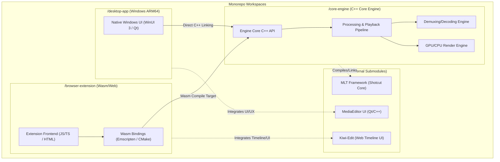

# High-Performance Cross-Platform Video Editor

This repository is organized as a monorepo containing the C++ core engine, native desktop client (Windows ARM64), and WebAssembly-based browser extension.

## Architecture Overview



---

## Directory Structure

*   **/core-engine**: High-performance, multi-threaded C++ engine responsible for timeline composition, audio/video decoding, effects processing, rendering, and encoding.
*   **/desktop-app**: Native Windows desktop application. Targets **Windows ARM64** natively, linking against the core engine and implementing a high-performance rendering canvas and system-native UI.
*   **/browser-extension**: WebAssembly (Wasm) browser extension. Compiles the C++ `/core-engine` into WebAssembly using Emscripten, packaging it with web-based timeline components for in-browser video manipulation.
*   **/vendor**: Git submodules housing third-party frameworks and external dependencies.

---

## System Design & Integration Strategy

### 1. Unified Core Engine (`/core-engine`)
The core engine is built in standard C++17/C++20 to guarantee absolute portability between the native ARM64 compilation toolchain (MSVC/Clang-cl) and the WebAssembly toolchain (Emscripten/Clang).
*   **Decoding/Demuxing**: Leverages modular decoders with fallbacks (via MLT/FFmpeg).
*   **Parallel Processing**: Utilizes thread pools for chunked rendering. WebAssembly utilizes Web Workers (Pthreads emulation) to match native multi-threading capabilities.

### 2. Native Desktop Application (`/desktop-app`)
*   **Platform Target**: Windows ARM64.
*   **Integration**: Statically links `/core-engine` to avoid dynamic linkage overhead.
*   **UI Integration**: Can utilize components from `vendor/MediaEditor` for visual timeline and preview widgets.

### 3. Browser Extension (`/browser-extension`)
*   **Platform Target**: Chromium & Firefox WebExtensions (utilizing Wasm).
*   **Integration**: Translates `/core-engine`'s API using Emscripten bindings (`EMSCRIPTEN_BINDINGS`).
*   **UI Integration**: Uses `vendor/Kiwi-Edit` for a performant Web-based timeline UI, driving the underlying WebAssembly engine pipeline.

---

## Dependencies & Submodules (`/vendor`)

The following libraries are imported as submodules:
1.  **MLT Framework (Shotcut)**: A multimedia framework designed for television broadcasting and video editors. Provides the plumbing for filters, transitions, and multi-track compositions.
2.  **MediaEditor UI**: A Qt/C++ video editor GUI repository containing rich timeline structures, layout patterns, and assets.
3.  **Kiwi-Edit**: A web-based collaborative video editor frontend, which serves as the visual reference and core timeline component for the browser extension.

---

## Quick Start

### 1. Clone the Monorepo
```bash
git clone <repository-url>
cd video
```

### 2. Initialize Submodules
Use the provided environment setup script to automatically pull down all vendor repositories:
```bash
# On Linux/macOS or Git Bash (Windows):
chmod +x setup_deps.sh
./setup_deps.sh
```

---

## Compilation Guidelines

### Native Windows ARM64 (Desktop App)
Requires **Visual Studio 2022** with the "Desktop development with C++" workload and the **MSVC v143 - VS 2022 C++ ARM64 build tools** package.
```cmd
mkdir build
cd build
cmake -A ARM64 ..
cmake --build . --config Release
```

### WebAssembly (Browser Extension)
Requires the **Emscripten SDK (emsdk)**.
```bash
cd browser-extension
mkdir build_wasm && cd build_wasm
emcmake cmake ..
emmake make
```
